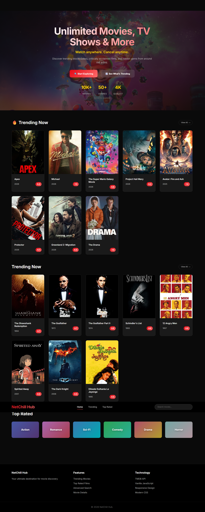

# NetChill Hub - Video on Demand Application

> A stunning, modern movie browsing web application built using Software Design Document (SDD) principles with vanilla JavaScript and TMDB API integration.

## 🎬 Overview
NetChill Hub is a cinematic movie discovery platform that provides users with an immersive experience to explore trending movies, search for specific titles, and view detailed movie information. Built as a frontend-only application following SDD methodology for structured development with a focus on modern UI/UX design.

## ✨ Features
- **🔥 Dynamic Hero Section**: Cinematic hero with rotating movie backdrops
- **📈 Trending Movies**: Browse currently popular movies with stunning visuals
- **⭐ Top Rated Movies**: Explore highest-rated films with enhanced cards
- **🔍 Smart Search**: Real-time movie search with debouncing and smooth animations
- **🎭 Movie Details**: Comprehensive information with immersive backdrop layouts
- **📱 Responsive Design**: Optimized for desktop, tablet, and mobile devices
- **⚡ Fast Performance**: API caching, lazy loading, and smooth transitions
- **🎨 Modern UI**: Glassmorphism effects, gradient overlays, and cinematic styling

## 🛠 Tech Stack
- **Frontend**: HTML5, CSS3, JavaScript (ES6+)
- **API**: The Movie Database (TMDB) REST API
- **Styling**: CSS Grid, Flexbox, Custom Properties, Glassmorphism
- **Architecture**: Component-based with client-side routing
- **Performance**: Fetch API with caching, lazy loading, smooth animations
- **Design**: Modern cinematic UI with Netflix-inspired aesthetics

## 🚀 Quick Start
1. **Get TMDB API Key**
   - Sign up at [TMDB](https://www.themoviedb.org/)
   - Get your API key from Settings → API

2. **Configure Application**
   ```javascript
   // In src/js/config.js
   API_KEY: 'your_tmdb_api_key_here'
   ```

3. **Run Application**
   ```bash
   # Open index.html in browser or use local server
   python -m http.server 8000
   # Then visit http://localhost:8000
   ```

## 📁 Project Structure
```
NetChill-Hub/
├── docs/                           # 📋 SDD Documentation
│   ├── constitution.md             # Project scope & boundaries
│   ├── feature-specifications.md   # Detailed feature requirements  
│   ├── task-breakdown.md          # Development task organization
│   ├── setup-guide.md             # Developer setup instructions
│   └── project-summary.md         # SDD implementation showcase
├── src/                           # 💻 Source Code
│   ├── css/
│   │   └── styles.css            # Enhanced cinematic stylesheet
│   └── js/
│       ├── config.js             # API configuration & constants
│       ├── api.js                # TMDB API service with caching
│       ├── components.js         # Enhanced UI components
│       ├── router.js             # Hash-based SPA routing
│       └── app.js                # Main application controller
├── assets/                        # 🖼 Static Assets
│   └── favicon.svg               # Custom movie-themed icon
├── index.html                     # 🏠 Main HTML entry point
└── README.md                      # 📖 Project documentation
```

## 🎨 Design Highlights

### Cinematic Hero Section
- **Dynamic Backdrops**: Rotating movie backdrops from trending films
- **Gradient Overlays**: Sophisticated color gradients for visual depth
- **Interactive Stats**: Real-time movie count and platform statistics
- **Call-to-Action**: Prominent buttons with hover animations
- **Scroll Indicator**: Animated scroll prompt for user guidance

### Enhanced Movie Cards
- **Hover Animations**: Smooth scale and lift effects
- **Gradient Borders**: Dynamic color borders on interaction
- **Rating Badges**: Stylized rating displays with shadows
- **Image Optimization**: Lazy loading with placeholder gradients

### Modern Navigation
- **Glassmorphism Header**: Backdrop blur with transparency
- **Smart Scroll**: Auto-hide header on scroll down
- **Active States**: Animated underlines for navigation links
- **Enhanced Search**: Improved search bar with focus effects

### Responsive Excellence
- **Mobile-First**: Optimized touch interactions
- **Flexible Grids**: Adaptive layouts for all screen sizes
- **Performance**: Reduced motion support for accessibility

## 📋 SDD Documentation
This project follows Software Design Document principles:

- **[Constitution](docs/constitution.md)**: Defines project scope, boundaries, and what we build vs. don't build
- **[Feature Specifications](docs/feature-specifications.md)**: Detailed requirements for each feature with acceptance criteria
- **[Task Breakdown](docs/task-breakdown.md)**: Organized development phases and task dependencies
- **[Setup Guide](docs/setup-guide.md)**: Complete developer onboarding instructions
- **[Project Summary](docs/project-summary.md)**: SDD implementation showcase and success metrics

## 🎯 Key Implementation Highlights

### Architecture Decisions
- **Component-Based**: Reusable UI components for maintainability
- **API Service Layer**: Centralized TMDB integration with intelligent caching
- **Hash Routing**: Client-side navigation without server requirements
- **Error Boundaries**: Comprehensive error handling and user feedback
- **Dynamic Content**: Real-time backdrop updates and content adaptation

### Performance Optimizations
- **API Caching**: 1-hour cache for API responses with intelligent invalidation
- **Lazy Loading**: Images load on demand with smooth transitions
- **Debounced Search**: Reduces API calls during typing (300ms delay)
- **Responsive Images**: Multiple image sizes for different viewports
- **CSS Animations**: Hardware-accelerated transitions and transforms

### User Experience Enhancements
- **Loading States**: Elegant spinners and skeleton screens
- **Error Recovery**: Retry mechanisms with user-friendly messaging
- **Smooth Scrolling**: Buttery smooth page transitions
- **Accessibility**: Semantic HTML, keyboard navigation, and reduced motion support
- **Visual Feedback**: Hover states, focus indicators, and micro-interactions

## 🌐 Browser Support
- Chrome 60+ (Recommended)
- Firefox 55+
- Safari 12+
- Edge 79+

## 📝 Development Workflow
1. **Planning**: SDD documentation defines scope and requirements
2. **Design**: Modern UI/UX with cinematic aesthetics
3. **Implementation**: Component-based development following specifications
4. **Testing**: Cross-browser and device testing with performance optimization
5. **Deployment**: Static hosting (GitHub Pages, Netlify, Vercel)

## 🤝 Contributing
This project demonstrates SDD methodology with modern web design. To contribute:
1. Review the constitution and feature specifications
2. Follow the established component architecture
3. Maintain the cinematic design language
4. Update documentation for any new features
5. Test across supported browsers and devices

## 📄 License
MIT License - feel free to use this project as a learning resource or starting point for your own movie applications.

---
ScreenShots of Application:


